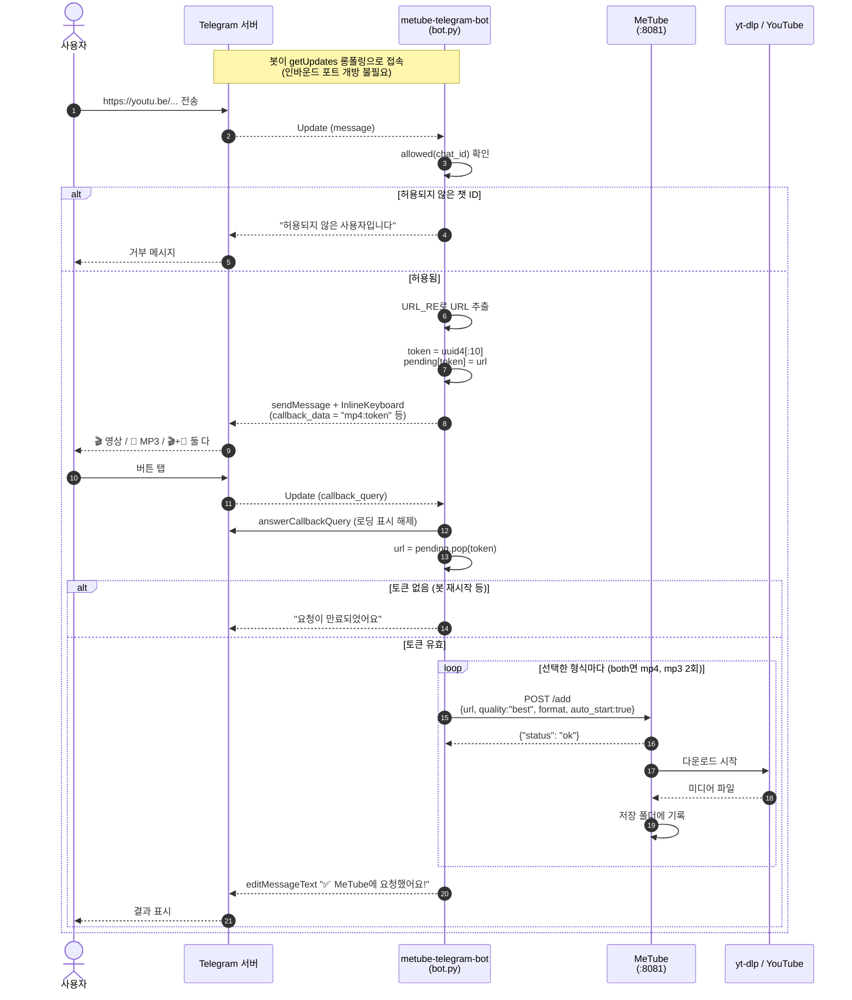
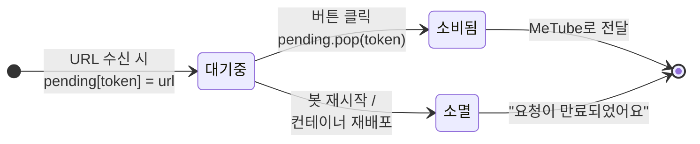
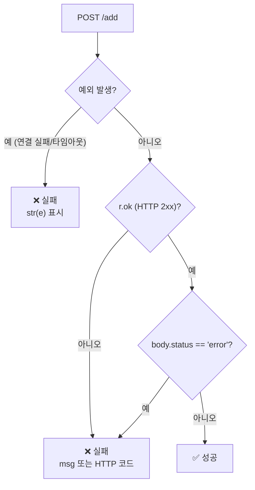
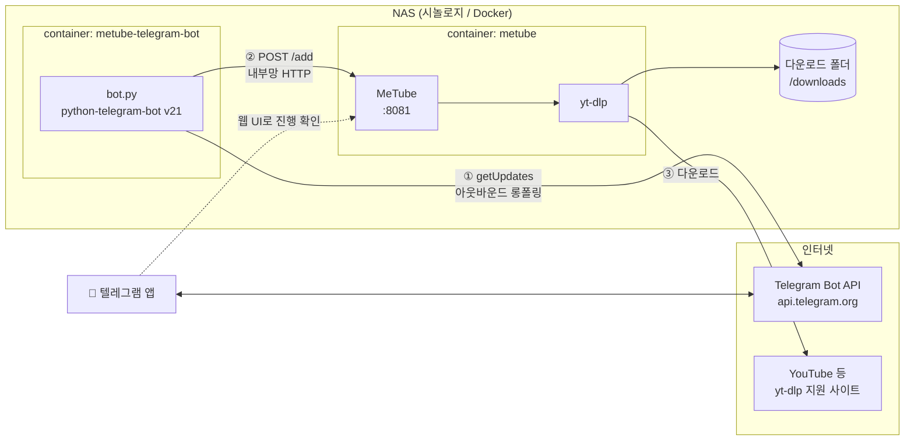
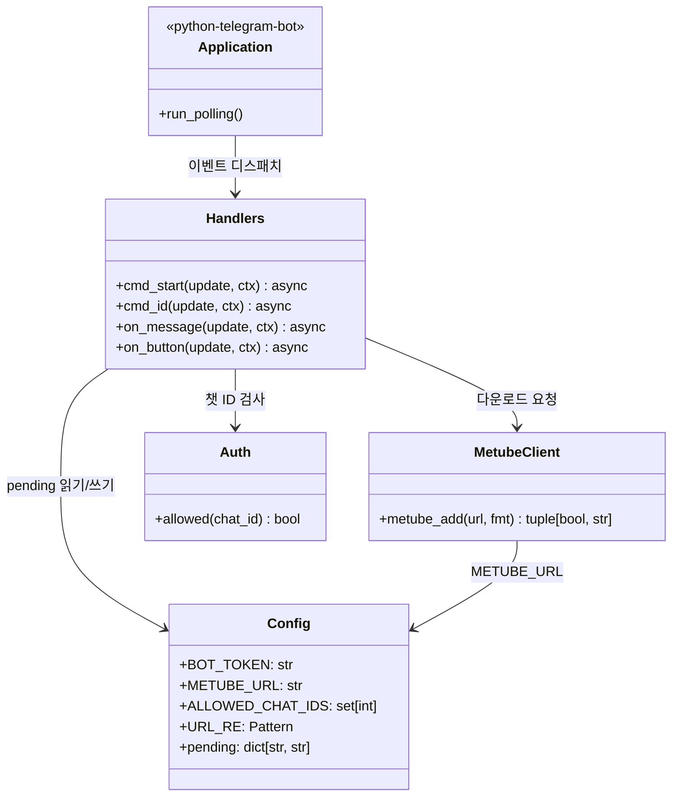
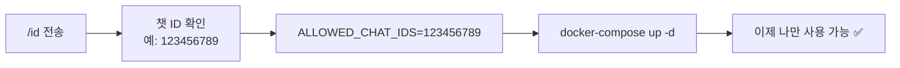

# MeTube Telegram Bot

텔레그램으로 유튜브 링크를 보내면 NAS의 [MeTube](https://github.com/alexta69/metube)가 대신 다운로드해 주는 작은 텔레그램 봇입니다.

A tiny Telegram bot that forwards YouTube (or any yt-dlp-supported) links to your self-hosted [MeTube](https://github.com/alexta69/metube) instance, so your NAS downloads them for you.

```
링크 전송  →  형식 버튼 선택  →  NAS가 알아서 다운로드
```

---

## 목차

- [기능](#기능--features)
- [동작 원리](#동작-원리--how-it-works)
- [구조](#구조--architecture)
- [설치](#설치--setup)
- [사용법](#사용법--usage)
- [환경 변수](#환경-변수--environment-variables)
- [주의사항](#주의사항--caveats)
- [문제 해결](#문제-해결--troubleshooting)

---

## 기능 / Features

- 🎬 영상 최고화질(MP4) / 🎵 최고음질 MP3 / 🎬+🎵 둘 다 — 링크마다 버튼으로 선택
- 한 메시지에 링크 여러 개를 넣으면 각각에 대해 버튼이 따로 표시됨
- 재생목록 링크 지원 (MeTube가 전체를 대기열에 등록)
- 폴링(long polling) 방식이라 포트 포워딩·외부 노출 불필요
- `ALLOWED_CHAT_IDS`로 허용된 사용자만 사용 가능
- 단일 파일(`bot.py`) + 의존성 2개 — 읽고 고치기 쉬움

---

## 동작 원리 / How it works

봇 자체는 **다운로드를 하지 않습니다.** 텔레그램과 MeTube 사이에서 "링크를 받아 형식을
물어보고, MeTube의 `/add` API로 넘기는" 얇은 중계기 역할만 합니다. 실제 다운로드,
대기열 관리, 파일 저장은 전부 MeTube(내부적으로 yt-dlp)가 담당합니다.

### 전체 흐름 (시퀀스)



### 왜 토큰을 쓰나요? (핵심 설계 포인트)

텔레그램의 `callback_data`는 **64바이트 제한**이 있어 긴 URL을 그대로 담을 수 없습니다.
그래서 URL마다 짧은 토큰(`uuid4().hex[:10]`)을 발급해 `callback_data`에는 `형식:토큰`만
넣고, 실제 URL은 프로세스 메모리의 `pending` 딕셔너리에 보관합니다.



> **의도된 트레이드오프**: `pending`은 디스크에 저장하지 않습니다. 봇을 재시작하면
> 아직 누르지 않은 버튼은 무효가 되고, 다시 누르면 만료 안내가 나옵니다.
> 링크를 다시 보내면 됩니다. (DB 없이 단일 파일을 유지하기 위한 선택)

### 성공/실패 판정

MeTube 응답은 **HTTP 200이고 본문의 `status`가 `"error"`가 아니면 성공**으로 봅니다.
`Content-Type` 헤더는 신뢰하지 않습니다 — 과거에 헤더 기반 판정 때문에 정상 요청을
실패로 표시하는 버그가 있었습니다.



---

## 구조 / Architecture

### 배포 구성 (컴포넌트)



**포인트**: 봇은 텔레그램으로 **바깥으로 나가는** 연결만 만듭니다. NAS에 포트를 열거나
공인 IP를 노출할 필요가 없습니다. 봇 → MeTube 호출은 같은 내부망(또는 같은 도커 네트워크)에서
이루어집니다.

### 모듈 구조 (bot.py)



| 핸들러 | 트리거 | 하는 일 |
|---|---|---|
| `cmd_start` | `/start` | 사용 안내 출력 |
| `cmd_id` | `/id` | 현재 대화의 챗 ID 표시 (`ALLOWED_CHAT_IDS` 설정용) |
| `on_message` | 명령이 아닌 텍스트 | URL 추출 → 토큰 발급 → 형식 선택 버튼 표시 |
| `on_button` | 인라인 버튼 콜백 | 토큰으로 URL 복원 → `metube_add()` 호출 → 결과로 메시지 수정 |

### 파일

| 파일 | 설명 |
|---|---|
| `bot.py` | 봇 전체 로직 (단일 파일) |
| `Dockerfile` | `python:3.12-slim` 기반 이미지 |
| `docker-compose.example.yml` | 공개용 템플릿 — 복사해서 `docker-compose.yml`로 사용 |
| `.gitignore` | 실제 토큰이 들어가는 `docker-compose.yml`, `.env` 제외 |

---

## 요구 사항 / Requirements

- 실행 중인 MeTube 인스턴스 (예: 시놀로지 Container Manager)
- Docker + docker-compose
- 텔레그램 봇 토큰 ([@BotFather](https://t.me/BotFather)에서 `/newbot`으로 발급)

---

## 설치 / Setup

```bash
git clone https://github.com/progh2/metube-telegram-bot.git
cd metube-telegram-bot
cp docker-compose.example.yml docker-compose.yml
# docker-compose.yml 을 열어 BOT_TOKEN, METUBE_URL 입력
docker-compose up -d --build
```

시놀로지 Container Manager를 쓴다면: 이 폴더를 `/volume1/docker/` 아래에 두고
**프로젝트 → 생성 → 폴더 선택 → 기존 docker-compose.yml 사용**으로 올리면 됩니다.

### 사용자 제한 (필수에 가까운 권장) / Restrict access

1. 봇에게 `/id` 를 보내 내 챗 ID 확인
2. `docker-compose.yml` 의 `ALLOWED_CHAT_IDS=` 에 입력 (쉼표로 여러 명 가능)
3. `docker-compose up -d` 로 재적용



> ⚠️ 비워두면 **봇 아이디를 아는 누구나** 여러분의 NAS에 다운로드를 시킬 수 있습니다.
> 텔레그램 봇 아이디는 검색으로 노출될 수 있으니 꼭 설정하세요.

---

## 사용법 / Usage

1. 봇과의 대화창에 링크를 보냅니다. (유튜브 앱의 "공유 → 텔레그램"이 가장 편합니다)
2. 뜨는 버튼에서 형식을 선택합니다.

| 버튼 | 결과 |
|---|---|
| 🎬 영상 (최고화질) | MP4, `quality: best` |
| 🎵 MP3 (최고음질) | MP3 오디오만 |
| 🎬+🎵 둘 다 | `/add`를 두 번 호출해 영상·음원 모두 등록 |

3. `✅ MeTube에 요청했어요!` 가 뜨면 대기열 등록 완료입니다.
4. 진행 상황과 완료 파일은 MeTube 웹 UI(기본 `:8081`)에서 확인합니다.

### 명령어

| 명령 | 설명 |
|---|---|
| `/start` | 사용 안내 |
| `/id` | 이 대화의 챗 ID 확인 |

---

## 환경 변수 / Environment variables

| 변수 | 설명 | 기본값 |
|---|---|---|
| `BOT_TOKEN` | 텔레그램 봇 토큰 (**필수** — 없으면 기동 실패) | - |
| `METUBE_URL` | MeTube 주소 (끝의 `/`는 자동 제거) | `http://localhost:8081` |
| `ALLOWED_CHAT_IDS` | 허용할 챗 ID (쉼표 구분, 비우면 **전체 허용**) | (비어 있음) |

---

## 주의사항 / Caveats

**보안**

- 🔴 `BOT_TOKEN`은 절대 커밋하지 마세요. 실제 값이 든 `docker-compose.yml`은 `.gitignore`에 등록되어 있습니다. 토큰이 유출됐다면 BotFather에서 `/revoke`로 즉시 폐기하세요.
- 🔴 `ALLOWED_CHAT_IDS`를 비워두지 마세요. 인증이 사라져 아무나 NAS 대역폭과 저장 공간을 쓰게 됩니다.
- 🟡 `METUBE_URL`은 내부망 주소를 쓰세요. MeTube를 외부에 노출하고 있다면 별도 인증(리버스 프록시 등)을 두는 편이 안전합니다.

**동작상의 제약**

- 🟡 **재시작하면 대기 중인 버튼은 무효**가 됩니다. `pending`이 메모리에만 있기 때문입니다 (위 [상태 다이어그램](#왜-토큰을-쓰나요-핵심-설계-포인트) 참고). 링크를 다시 보내면 됩니다.
- 🟡 봇이 알려주는 것은 **"MeTube에 요청 성공"까지**입니다. 다운로드 자체의 성공/실패는 MeTube 웹 UI에서 확인해야 합니다.
- 🟡 `both`는 `/add`를 두 번 호출하므로 **같은 영상이 MP4와 MP3 두 항목**으로 대기열에 올라갑니다.
- 🟡 URL 추출은 `https?://\S+` 정규식입니다. 링크 뒤에 괄호·구두점이 붙어 있으면 그대로 포함될 수 있습니다.
- 🟡 재생목록 URL을 보내면 MeTube가 **전체를 등록**합니다. 한 편만 받고 싶다면 MeTube 컨테이너의 `YTDL_OPTIONS`에 `{"noplaylist": true}`를 설정하세요 (봇이 아니라 MeTube 쪽 설정입니다).
- 🟡 봇 인스턴스는 하나만 띄우세요. 같은 토큰으로 두 개가 폴링하면 업데이트를 서로 뺏어갑니다.

**코드 수정 시**

- 코드는 이미지 안으로 `COPY`되므로 수정 후 **반드시 재빌드**해야 반영됩니다: `docker-compose up -d --build` (캐시 문제 시 `docker-compose build --no-cache`). Container Manager GUI에서는 프로젝트 빌드 후 **중지 → 시작**까지 해야 합니다.

---

## 문제 해결 / Troubleshooting

| 증상 | 확인할 것 |
|---|---|
| 봇이 아무 반응이 없음 | 컨테이너 로그(`docker logs metube-telegram-bot`)에 `bot started`가 찍혔는지, `BOT_TOKEN`이 맞는지 |
| "허용되지 않은 사용자입니다" | `/id`로 확인한 값이 `ALLOWED_CHAT_IDS`에 있는지 (쉼표 구분, 공백 무관) |
| "요청 실패: ... Connection refused" | `METUBE_URL`이 컨테이너에서 접근 가능한 주소인지. `localhost`는 봇 컨테이너 자신을 가리킵니다 — NAS 내부 IP나 도커 네트워크상의 서비스명을 쓰세요 |
| "요청이 만료되었어요" | 봇이 재시작된 경우입니다. 링크를 다시 보내세요 |
| 요청은 성공인데 파일이 없음 | MeTube 웹 UI에서 해당 항목의 오류 메시지 확인 (지역 제한, 로그인 필요 영상 등) |

### 로컬에서 점검

```bash
python -m py_compile bot.py                      # 문법 검사
BOT_TOKEN=123:dummy python -c "import bot"       # import 스모크 테스트
```

---

## 주의 / Disclaimer

개인 소장 용도로만 사용하세요. 콘텐츠 다운로드 시 YouTube 서비스 약관 및 해당
콘텐츠의 저작권을 준수할 책임은 사용자에게 있습니다.

For personal use only. You are responsible for complying with YouTube's Terms of
Service and applicable copyright law.

## License

[MIT](LICENSE)
